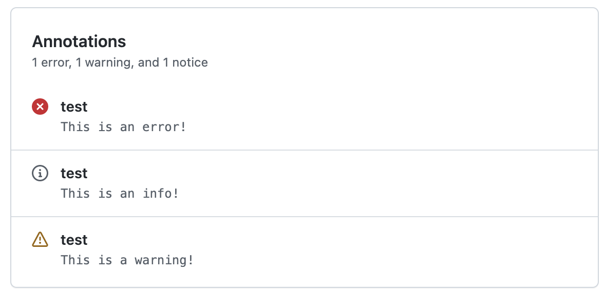

<p align="center">
  <a href="https://github.com/actions/typescript-action/actions"></a>
</p>

# Annotate runs github action 🚀

This github action provides a very simple interface to add an annotation to a github run.

## Inputs

All inputs are optional!

You can add info, warn and error - the inputs are simple strings which will be routed
to the github action output.

- info : string
- warning: string
- error: string

## Outputs

This github actions does not have any outputs, it just annotates ( or not :) )

## Example usage

```yml
uses: mholetzko/annotate_runs@v1.0.0
with:
  info: 'This is an info'
  warning: 'This is a warning'
  error: 'This is an error'
```

Doing so, you will the following output of your run. Keep in mind, that the heading is equal to your step name.

